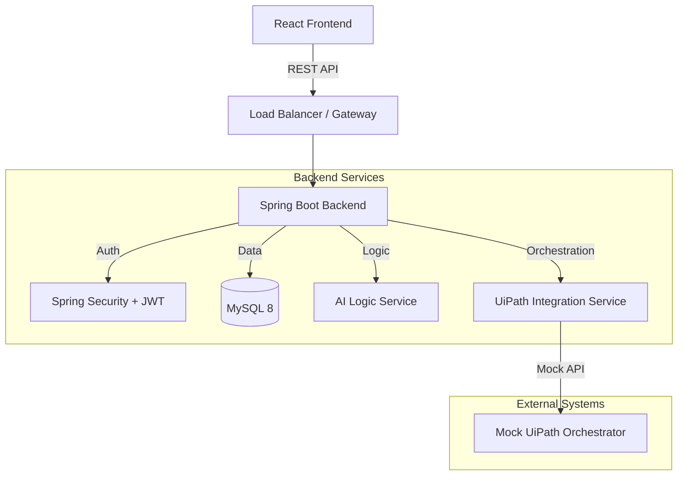

# District-IACC Project Architecture & File Structure

## 1. Project Overview
**District Intelligent Administration Command Center (District-IACC)** is a centralized dashboard for district-wide monitoring, AI-driven task routing, and UiPath automation integration.

## 2. Technical Stack
- **Backend**: Java 17, Spring Boot 3.x, Spring Security (JWT), Hibernate/JPA, MySQL 8.
- **Frontend**: React 18 (TypeScript), Vite, Tailwind CSS, Shadcn/UI, Recharts.
- **Integration**: Mock UiPath Orchestrator REST API, AI Classification Service.

## 3. Architecture Diagrams

### High-Level Architecture


### Database Schema
- **User**: ID, Username, Password, Role (COLLECTOR, DEPT_HEAD, STAFF, AUTO_SUPERVISOR), Department.
- **Task**: ID, Title, Department, Priority, Status, AI_Classification, AssignedBotType, DeadLine, CreatedBy.
- **AutomationJob**: ID, TaskID, BotID, Status (PENDING, RUNNING, SUCCESS, FAILED), StartTime, EndTime, Logs.
- **AuditLog**: ID, Timestamp, User, Action, IPAddress.

## 4. File Structure (Proposed)

### Backend (Spring Boot) `BACK_END/iacc`
```
src/main/java/com/mano/iacc/
├── config/                 # Security, CORS, Swagger configs
│   ├── SecurityConfig.java
│   └── JwtTokenProvider.java
├── controller/             # REST Controllers
│   ├── AuthController.java
│   ├── TaskController.java
│   ├── DashboardController.java
│   └── AutomationController.java
├── dto/                    # Data Transfer Objects
│   ├── AuthRequest.java
│   └── TaskRequest.java
├── entity/                 # JPA Entities
│   ├── User.java
│   ├── Task.java
│   ├── AutomationJob.java
│   └── AuditLog.java
├── repository/             # JPA Repositories
│   ├── UserRepository.java
│   └── TaskRepository.java
├── service/                # Business Logic
│   ├── AuthService.java
│   ├── TaskService.java
│   ├── AiRoutingService.java
│   └── UiPathService.java
└── IaccApplication.java
```

### Frontend (React + Vite) `FRONT_END/iacc`
```
src/
├── assets/                 # Images, Icons
├── components/             # Reusable UI Components
│   ├── ui/                 # Shadcn/UI components (Button, Card, Input)
│   ├── layout/             # Sidebar, TopBar, DashboardLayout
│   ├── dashboard/          # KPI Widgets, LiveFeed
│   └── forms/              # TaskSubmissionForm
├── context/                # Global State (AuthContext, ThemeContext)
├── hooks/                  # Custom Hooks (useAuth, useTask)
├── lib/                    # Utilities (utils.ts)
├── pages/                  # Page Views
│   ├── LoginPage.tsx
│   ├── DashboardPage.tsx
│   ├── DepartmentView.tsx
│   └── AuditLogsPage.tsx
├── services/               # API Calls (axios instances)
│   ├── authService.ts
│   └── api.ts
├── App.tsx                 # Main Component with Routes
└── main.tsx                # Entry Point
```

## 5. Implementation Phases
1.  **Phase 1**: Backend Setup (Entities, Repositories, Security).
2.  **Phase 2**: Frontend Setup (Tailwind, Shadcn, Layouts).
3.  **Phase 3**: Task Logic & AI Routing.
4.  **Phase 4**: Analytics & Auditing.
